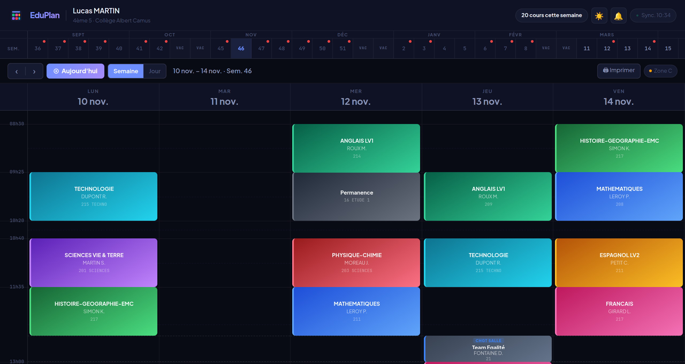
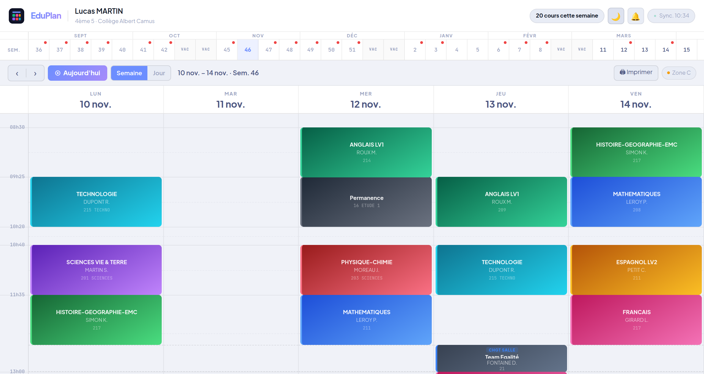
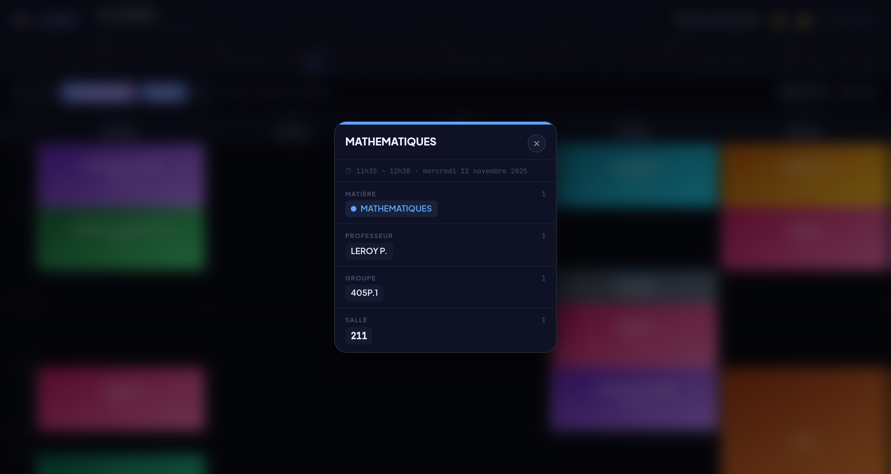
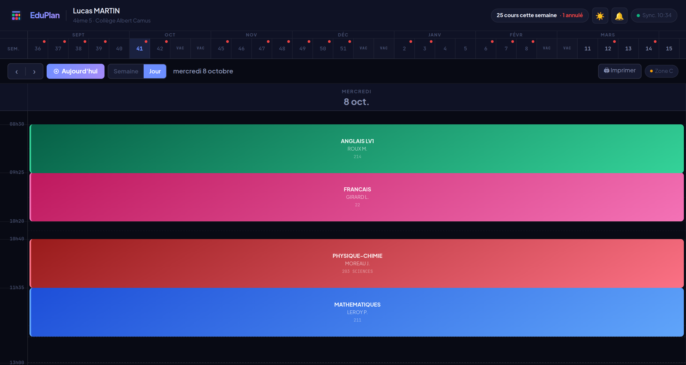
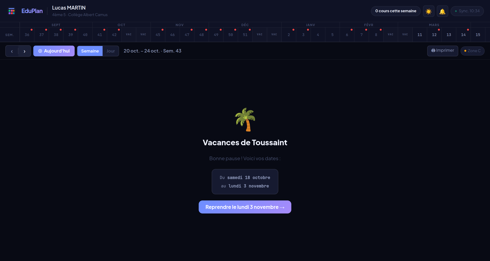

# EduPlan ✦ Emploi du temps Pronote

> Une application web légère, belle et rapide pour votre emploi du temps Pronote.  
> Zéro serveur · Zéro installation · Double-clic et c'est parti.

[](LICENSE)
[](https://github.com/Zorglub385/eduplan/releases/latest)
[](https://github.com/Zorglub385/eduplan/issues)

---

## Aperçu


*Vue semaine — mode sombre*


*Vue semaine — mode clair*

<details>
<summary>Voir plus de captures</summary>


*Modal de détail — clic sur un cours*


*Vue jour — navigation rapide*


*Message de vacances avec dates et bouton de reprise*

</details>

---

## 👉 [Voir la démo live →](https://zorglub385.github.io/eduplan/)
*Données fictives anonymisées — aucune vraie information personnelle*

---

## Démarrage rapide

**1.** [⬇️ Télécharger le ZIP](../../releases/latest) → extraire  
**2.** Ouvrir `config.js` → coller votre URL iCal Pronote  
**3.** Double-cliquer sur `index.html`

C'est tout. Aucun serveur, aucun compte, aucune installation.

---

## Fonctionnalités

| | |
|--|--|
| 📅 | Emploi du temps en temps réel depuis Pronote |
| 🌙 ☀️ | Mode sombre et mode clair, persistant |
| 🗓 | Vue semaine et vue jour (clic sur l'en-tête d'un jour) |
| ⚠️ | Alerte automatique si cours annulés cette semaine |
| 🌴 | Page vacances avec nom de la période, dates exactes, bouton de reprise |
| 🔴 | Ligne "maintenant" + cours en cours mis en surbrillance pulsante |
| 🔔 | Notifications navigateur (5 min avant chaque cours) |
| 🖨️ | Impression / Export PDF en A4 paysage |
| ↔️ | Animations de navigation fluides |
| 📍 | Détection automatique de la zone scolaire A/B/C par IP |
| ⌨️ | Raccourcis clavier complets |

---

## Installation

### Option A — Sans Git (recommandé pour débuter)

1. [Télécharger la dernière release](../../releases/latest)
2. Extraire le ZIP
3. Ouvrir `config.js` dans un éditeur de texte
4. Coller votre URL iCal Pronote
5. Double-cliquer sur `index.html`

### Option B — Avec Git

```bash
git clone https://github.com/Zorglub385/eduplan.git
cd eduplan
# Ouvrez config.js et collez votre URL Pronote
# Double-cliquez sur index.html
```

---

## Configuration

Ouvrez **`config.js`** — c'est le **seul fichier à modifier** :

```js
const EDUPLAN = {

  // Votre URL iCal Pronote (voir ci-dessous comment la trouver)
  ICS_URL: "https://votre-etab.index-education.net/pronote/ical/...",

  NOM:           "Prénom NOM",
  CLASSE:        "3ème B",
  ETABLISSEMENT: "Collège ...",

  ZONE:  "AUTO",   // Détection auto, ou forcer "A", "B" ou "C"
  THEME: "dark",   // "dark" ou "light"
};
```

### Où trouver l'URL iCal Pronote ?

1. Connectez-vous sur **Pronote** (espace élève ou parent)
2. Cliquez sur l'icône **⚙ Paramètres** (en haut à droite)
3. Onglet **Agenda**
4. Bouton **Exporter le calendrier**
5. Copiez le **lien iCal**

> ⚠️ **Sécurité** : l'URL contient un token personnel (`icalsecurise=...`).  
> Ne la commitez jamais publiquement. Le `.gitignore` fourni ignore déjà `config.js`  
> si vous utilisez Git — gardez-le hors du dépôt.

---

## Raccourcis clavier

| Touche | Action |
|--------|--------|
| `←` | Semaine / jour précédent |
| `→` | Semaine / jour suivant |
| `Entrée` | Revenir à aujourd'hui |
| `W` | Basculer en vue Semaine |
| `D` | Basculer en vue Jour |
| `Échap` | Fermer la fenêtre de détail |

---

## Zones de vacances 2025-2026

| Zone | Académies |
|------|-----------|
| **A** | Besançon, Bordeaux, Clermont-Fd, Grenoble, Limoges, Lyon, Nantes, Poitiers |
| **B** | Aix-Marseille, Amiens, Caen, Lille, Nancy-Metz, Nice, Orléans-Tours, Reims, Rennes, Rouen, Strasbourg |
| **C** | Créteil, Montpellier, Paris, Toulouse, Versailles |

Avec `ZONE: "AUTO"`, la zone est détectée automatiquement via [ipwhois.app](https://ipwhois.app) (requête IP → région → zone).

---

## Structure du projet

```
eduplan/
├── index.html      — Application complète (HTML + CSS + JS en un seul fichier)
├── config.js       — ⭐ Votre configuration personnelle (seul fichier à modifier)
├── .gitignore      — Protège config.js pour ne pas exposer votre URL Pronote
└── README.md
```

**Branches :**
| Branche | Rôle |
|---------|------|
| `main` | Code source — `config.js` vierge, prêt à configurer |
| `Example` | Démo GitHub Pages — emploi du temps fictif anonymisé |

---

## Contribuer

Les Pull Requests sont les bienvenues ! Merci de lire [CONTRIBUTING.md](CONTRIBUTING.md) avant toute modification.

**Idées en attente :**
- Support d'autres ENT (Espace Numérique de Travail)
- Export `.ics` personnalisé
- Widget mobile / extension navigateur

Pour signaler un bug → [ouvrir une Issue](../../issues/new/choose)

---

## Vie privée

- Aucun cookie, aucun analytics, aucun tracker
- Seules deux requêtes externes sont effectuées :
  - Votre calendrier Pronote (via un proxy CORS public, nécessaire pour contourner les restrictions navigateur)
  - Une requête IP vers [ipwhois.app](https://ipwhois.app) pour détecter votre zone scolaire (désactivable en forçant `ZONE: "C"`)

---

## Compatibilité

✅ Chrome · Firefox · Safari · Edge — bureau et mobile  
❌ Internet Explorer non supporté

---

*EduPlan est un projet indépendant, non affilié à Pronote / Index Éducation.*
